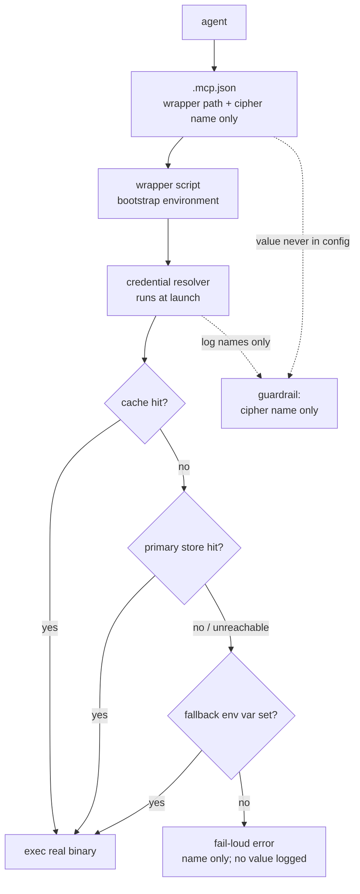

# mcp-patterns

a pattern library for wiring MCP servers to AI agents in production. wrappers,
templates, and the discipline that keeps credentials, tenancy, and host-locality
from leaking through the cracks.

> this repo wraps work upstream of WiseHash — anthropic's MCP specification and
> the first-party mcp servers (linear, github, and the others). it builds on
> nate b. jones's framing of agent infrastructure as a real, layered stack;
> alan shurafa's contributions to the openclaw / ob1 ecosystem informed several
> of the credential-tenancy patterns here. i am ashton papi; i operate wisehash,
> and i started codifying these wrappers because the agents i run weekly stopped
> colliding with each other once the wiring layer was named.

WiseHash wires MCP servers to agents in four patterns — wrapper-as-launcher,
credential-resolution chain, stdio-over-ssh for cross-host servers, and
per-tenant alias-native credentials. every wrapper is a small bash script that
bootstraps environment, resolves credentials at exec time, and `exec`s the real
binary. the patterns exist because credentials in `.mcp.json` are a credential
leak in waiting, and a plaintext token surface in the most-edited file in the
repo is a survival problem the wiring layer solves once.

a fifth candidate — HTTP-to-stdio bridging — was evaluated and **rejected**; the
receipt is kept (`patterns/http-to-stdio-rejected.md`) so the absence is a
decision, not an oversight.

what this repo is:
- a set of markdown documents
- a wrapper template
- one sanitized worked example

what this repo is not:
- an mcp server
- an installable package
- a credential store
- a sales methodology

the patterns make their own case through receipts.

## the four patterns

**wrapper-as-launcher** — every MCP server runs through a small bash wrapper.
the wrapper bootstraps environment, resolves credentials at exec time, and
`exec`s the real binary. the agent's `.mcp.json` points at the wrapper path,
not at the binary. this indirection is the load-bearing primitive — see
[`patterns/wrapper-as-launcher.md`](patterns/wrapper-as-launcher.md).

**credential-resolution chain** — the wrapper resolves credentials in a
defined order: cache → primary store → fallback → error. every link is
explicit, every miss is logged without exposing the value, and the last link
fails loud rather than starting with a missing credential — see
[`patterns/credential-resolution-chain.md`](patterns/credential-resolution-chain.md).

**stdio-over-ssh** — when the MCP server's authoritative state (database,
credential store, runtime config) lives on a different host than the agent,
the local wrapper either fails or spawns a duplicate empty instance. the
remote wrapper variant `exec`s SSH to the canonical host and pipes stdio
both ways — see [`patterns/stdio-over-ssh.md`](patterns/stdio-over-ssh.md).

**per-tenant alias-native credentials** — when the same MCP server serves
multiple agent identities (different bearer tokens, different audit-trail
attribution), the wrapper accepts an alias env var and resolves the right
credential cipher per call; the server resolves the incoming token back to an
identity to attribute every action — see
[`patterns/per-tenant-aliases.md`](patterns/per-tenant-aliases.md).

## security

the credential discipline is the point of this repo, so the invariants are
collected here rather than left implicit across the pattern docs:

- **credentials resolve at exec time, never at config time.** the cipher *name*
  may live in `.mcp.json`; the cipher *value* never does, and never lands in any
  dotfile — see
  [`patterns/credential-resolution-chain.md`](patterns/credential-resolution-chain.md).
- **a value is never logged.** a miss is logged by name; the error says what to
  fix, not what was attempted.
- **the chain fails loud.** a missing credential halts with a clear remediation
  rather than starting an agent against a silently-absent secret.
- **per-tenant attribution is explicit.** when one server serves several agent
  identities, the wrapper selects the cipher per call and the server resolves the
  token back to an identity for the audit trail — see
  [`patterns/per-tenant-aliases.md`](patterns/per-tenant-aliases.md).

the chain, walked at every launch — only the cipher *name* crosses into config,
and a miss fails loud rather than starting on a silently-absent secret:

**credential handling is environment-specific by design.** these patterns name a
*contract*, not a backend: resolve late, expose names not values, fail loud. the
worked example uses a REST-based sovereign vault, but the same contract holds
against a CLI password manager, a cloud-provider secret manager, or an on-prem
store. the wrapper is the seam where your environment's mechanism plugs in —
adopt the contract and supply your own resolver. do not lift the example's
specific store assuming it is the pattern; the resolver is yours to bring.

## evaluated and rejected

**HTTP-to-stdio bridging** — first-party MCP servers speak HTTP transport. a
common tutorial move bridges them down to stdio via an `mcp-remote` / `mcp-proxy`
process. we evaluated it and rejected it: the dominant first-party agent CLIs
speak HTTP natively, so the bridge adds an npm dependency, an extra process in
the tree, and a second credential surface with no sovereignty benefit. let the
client speak HTTP directly. full reasoning in
[`patterns/http-to-stdio-rejected.md`](patterns/http-to-stdio-rejected.md).

## the wrapper template

[`templates/wrapper.sh.template`](templates/wrapper.sh.template) is a
directly-runnable bash skeleton with substitution markers. an operator copies
it into their own `scripts/` directory, replaces the `<ANGLE_BRACKET_TOKENS>`
with the service-specific values, and points their agent's `.mcp.json` at the
new wrapper. the template is intentionally bash-only — a Python or Node
template would introduce a runtime dependency for the wrapper itself, which
defeats the indirection point.

## cross-host MCP as a wiring primitive

most MCP server tutorials assume the server and the agent run on the same
machine. real production deployments often don't — credential stores,
databases, or runtime config live on a different host than the agent runtime.
the stdio-over-ssh pattern is the smallest possible bridge across that gap
without duplicating state.

paired with [`wisehash-llc/dispatch-protocol`](https://github.com/wisehash-llc/dispatch-protocol),
the wiring layer becomes a complete substrate: dispatch-protocol routes work
between AI peers; mcp-patterns wires the tools those peers reach for. the two
repos are independent — either is useful on its own — but they compose.

## operating note

MCP wiring is read once, at agent-session start — a changed wrapper, `.mcp.json`,
or tool schema does not hot-reload into a running session. see
[`patterns/no-hot-reload.md`](patterns/no-hot-reload.md).

## status

- **version:** v0.2.1
- **license:** [Apache 2.0](LICENSE) (federation default)
- **provenance:** patterns extracted from several months of production use
  across mixed-model agent peers
- **scope:** stdio-transport wiring. HTTP-transport servers are handled natively
  by the client, not bridged — see
  [`patterns/http-to-stdio-rejected.md`](patterns/http-to-stdio-rejected.md).
- **maintainer:** [ashton-papi](https://github.com/ashton-papi)

WiseHash operates [wisehash.io](https://wisehash.io). this repo is part of
the [`wisehash-llc`](https://github.com/wisehash-llc) federation of focused
public repos covering the operational shape of sovereign agent infrastructure.
